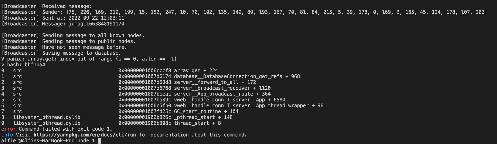

# 2.2.11 Cycle 11 - Remembering Nodes

## Design

### Objectives

The next step to building a network in which nodes can successfully communicate across is for the node software to remember which nodes it has come into contact with previously so that it can send messages it receives from other nodes onto it's remembered nodes in the future.

This is what will create the networking effect that allows for messages to flow throughout the entire network without having to have any form of central server.

<figure><figcaption><p>A diagram showing how communication across the network works.</p></figcaption></figure>

The diagram above shows how such a message flow would work, with node 'a' wanting to send a message across the network which will end up with every node having read it, including node 'g' at the opposite side. The way in which this will work can be explained using a few stages:

1. Node 'a' sends the message to all nodes it's aware of, in this case only node 'b', this is represented by green arrow and number.
2. Node 'b' receives the message, checks it's valid, approves it and then forwards it on to all the nodes it knows (apart from the node it just came from - 'a'), this is blue.
3. Nodes 'c' and 'd' receive the message from 'b', validate it and then forward it on to the nodes they know of, this is pink.
4. Nodes 'e' and 'f' both receive the message, validate it and then begin to send it on to any node they know of that didn't send them the message. Although in this case they don't know that the other node has already seen the message so they send it on anyway. Since node 'f' is also connected to node 'g' this does mean that 'g' is also sent the message. This is represented by the colour orange.
5. All nodes have now seen the message and therefore the cycle is complete.

#### Therefore the primary objectives this cycle are:

* [ ] Nodes should store references to other Nodes.
* [ ] Nodes should send handshakes to nodes upon connecting to the network.
* [ ] Nodes should send a handshake back to any node that sends them one that they haven't seen before.

### Usability Features

* Feature 1
* Feature 2

### Key Variables

| Variable Name | Use |
| ------------- | --- |
|               |     |
|               |     |
|               |     |

### Pseudocode

Objective 1 solution:

```
```

Objective 2 solution:

```
```

## Development

Most of the development for this cycle was just setup, to get everything I need for this project up and running and building out the structure of the codebase in order to make the actual programming as smooth as possible.

### Outcome

#### Handling References

```v
module memory

// internal imports
import utils
// external imports
import json


// This is a simple way of storing the node's memory of other nodes that it's encountered.

pub struct References {
	path string
	mut:
		keys map[string][]u8	// this maps a reference the pub key that it runs using.
		blacklist map[string]bool	// this is a list of pub keys that we've already seen and do not trust. Erased when the node is restarted.
}

fn (Ref References) save() {
	// create a new object to ignore blacklisted keys
	raw := json.encode(References{
		path: Ref.path
		keys: Ref.keys
	})
	utils.save_file(Ref.path, raw, 0)
}

fn new(file_path string) References {
	ref := References{
		path: file_path
		keys: map[string][]u8{},
		blacklist: map[string]bool{},
	}
	ref.save()
	return ref
}

pub fn get_refs(file_path string) References {
	raw := utils.read_file(file_path, true)
	mut refs := new(file_path)	// incase no file or error

	if raw.loaded != false {
		// convert the json data to a References struct.
		refs = json.decode(References, raw.data) or {
			// if the json is invalid, create a new one.
			new(file_path)
		}
	}

	return refs
}

pub fn (refs References) aware_of(reference string) bool {
	// check if the reference is in the blacklist.
	if refs.blacklist[reference] {
		// we have encountered this reference before and it is blacklisted.
		return true
	}

	// if it is not blacklisted, check if the reference is in the keys.
	if reference in refs.keys {
		// we have encountered this reference before and it is not blacklisted.
		return true
	}

	// we have not encountered this reference before.
	return false
}

pub fn (mut refs References) add_key(reference string, key []u8) {
	// add the key to the keys map.
	refs.keys[reference] = key
	// save the references.
	refs.save()
}

pub fn (mut refs References) add_blacklist(reference string) {
	// add the reference to the blacklist.
	refs.blacklist[reference] = true
	// save the references.
	refs.save()
}
```

#### Using references when receiving a handshake.

```v
println("Handshake Analysis Complete. Sending response...")
// now need to figure out where message came from and respond back to it
refs := memory.get_refs(config.ref_path)
if !refs.aware_of(req_parsed.initiator.ref) {
	println("Node has not come into contact with initiator before, sending them a handshake request")
	// send a handshake request to the node
	start_handshake(req_parsed.initiator.ref, config)
} else {
 	println("Node has come into contact with initiator before, no need to send a handshake request")
}
```

#### Using references when sending a handshake.

```v
mut refs := memory.get_refs(config.ref_path)

// this verifies that the received handshake is valid
// signed hash can then be verified using the wallet pub key supplied
if data.message == msg && data.initiator.key == this.self.key {
	if cryptography.verify(data.responder_key, data.message.bytes(), data.signature) {
		// handshake was valid.
		println("Verified signature to match handshake key\nHandshake with $ref successful.")

		// now add them to reference list
		refs.add_key(ref, data.responder_key)
		return true
	}
	
	// handshake signature was not valid
	println("Signature did not match handshake key, node is not who they claim to be.")
	// store a record of the node's reference and temporarily blacklist it
	refs.add_blacklist(ref)
	return false
}

// handshake message was not assembled correctly.
println("Handshake was not valid, node is not who they claim to be.")
println(data)
// node is not who they claim to be, so temporarily blacklist it
refs.add_blacklist(ref)
```

### Challenges

Challenges faced in either/both objectives

## Testing

### Tests

| Test | Instructions | What I expect | What actually happens | Pass/Fail |
| ---- | ------------ | ------------- | --------------------- | --------- |
| 1    |              |               |                       |           |
| 2    |              |               |                       |           |
| 3    |              |               |                       |           |

### Evidence

(Images of tests running/results)
