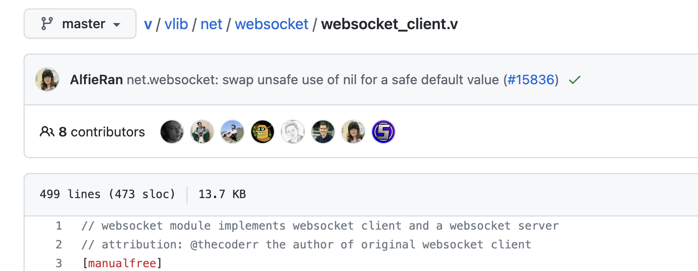

# 2.2.14 Cycle 14 - Adding Web sockets for dynamic Nodes.

## Design

### Objectives

Currently the only way a node can contribute to a network is if it either has a static public DNS/IP address that it can be reached at or if it has a direct local connection to a node with such an address. This is a problem because it means that users have to setup some kind of port forwarding, networking tunnel or some other somewhat complicated method just to connect to the network which increases the barrier to entry and is obviously not good.

The solution to this is to introduce web sockets so that "private" nodes without a public address can open a communication tunnel to a public node that can then communicate with it in either direction and therefore continue to use it for the network without having such a high barrier to entry.

* [ ] Convert the main section of the handshake method into a function so that it can be used with either web sockets or http.
* [ ] Add a web sockets object to the references created in the last cycle so that nodes don't get http addresses and web socket ids mixed up.
* [ ] Successfully ensure that the handshake method works for both http and web sockets.

### Usability Features

* Feature 1
* Feature 2

### Key Variables

| Variable Name | Use |
| ------------- | --- |
|               |     |
|               |     |
|               |     |

### Pseudocode

Objective 1 solution:

```
```

Objective 2 solution:

```
```

## Development

Development moment

### Outcome

#### The test code

This was the test code for confirming that shared variables do in fact do what I needed them to do.

```v
struct Info {
	test int
}

struct App {
	vweb.Context
	info shared Info
}
 
pub fn start(config configuration.UserConfig) {
	info := Info{test: 0}
	app := App{info: info}
	api := go vweb.run(app, config.port) // start server on a new thread
	
	// there's some other code here but it isn't important in this cycle
	
	api.wait()	// bring server process back to main thread
}

["/test"]
pub fn (mut app App) test() vweb.Result {
	println(app)
	mut result := ""
	lock app.info {
		cur := app.info.test
		result = json.encode(cur)
		app.info = Info{test: cur + 1}
	}
	return app.text(result)
}
```

Objective 2

```
code
```

### Challenges

The main challenge faced through the development of this cycle was not one of my own code, but instead of the language that I am using's standard library. In particular, the `log` module that is included within it.

#### The Problem

The error in particular was due to a the generation of a function to generate a 'logger' (an object that allows for the logging of the program in a log file or terminal output) which upon being fed the value 'nil' (representing nothing) should generate a default logger using the Log object, however in certain circumstances it was instead attempting to generate the logger from a `voidptr` object - which is just an empty object in C.

This happens because Vlang is built on top of the low level language C, and therefore when it is compiled, the code gets compiled from V to C and then from C to an executable for whatever platform is being targeted.

This is the C code being generated by Vlang.

```c
.logger = HEAP(log__Logger, /*&log.Logger*/I_voidptr_to_Interface_log__Logger(HEAP(voidptr, (((void*)0)))))
```

This is the C code that should've been generated.

```c
.logger = HEAP(log__Logger, /*&log.Logger*/I_log__Log_to_Interface_log__Logger(((log__Log*)memdup(&(log__Log){.level = log__Level__info,.output_label = (string){.str=(byteptr)"", .is_lit=1},.ofile = (os__File){.cfile = 0,.fd = 0,.is_opened = 0,},.output_target = 0,.output_file_name = (string){.str=(byteptr)"", .is_lit=1},}og__Log))))
	
```

#### The fix

Although completing the actual fix was fairly quick and easy, finding what was broken in the first place was a lot more complicated. This involved writing testing files to ensure it was actually a compiler issue and not just my code, then careful reading of the semi-compiled C files generated by Vlang to find the compiler error, then changing pieces of code in the compiler one line at a time to figure out how to prevent it from happening until eventually - after about 3 days of repetitive bug hunting - I stumbled upon what I needed.

The quick fix for this was relatively simple and only required changing the default value for the logger inside the net.websocket module (which is where the logger module was incorrectly generating code) from `nil` to a `Log object` although this didn't actually fix the root problem, it did solve it enough for me to carry on working on my project and fixing the root problem would've been far outside the scope of this project.

After creating this fix and validating that it didn't break anything else, I realised that other developers with less experience in this kind of thing might be having this issue and be getting completely stuck so I decided to share my edited version of the compiler by submitting a 'pull request' to the Github repository. This allows the team that make the Vlang compiler to approve my change and make it part of the official Vlang compiler.

One of the members of the Vlang team then confirmed that the bug I had discovered did in fact exist, validated that my version didn't break anything else, created a test to stop it happening in the future and then merged my changes into the compiler. This means that as a byproduct of this A Level project I have contributed to the compiler of a language used by hundreds of thousands of people!

#### The code I changed

Here are the two fixes I made, the top image looks like I changed a lot more than I actually did but that's just to me changing the code comments slightly.

<figure><figcaption><p>The code I changed (green is my code and red is what it replaced)</p></figcaption></figure>

<figure><figcaption><p>The code I changed (green is my code and red is what it replaced)</p></figcaption></figure>

<figure><figcaption><p>A screenshot of my commit in the official V git repository.</p></figcaption></figure>

## Testing

### Tests

| Test | Instructions                                                                                   | What I expect                                                                                 | What actually happens                                           | Pass/Fail |
| ---- | ---------------------------------------------------------------------------------------------- | --------------------------------------------------------------------------------------------- | --------------------------------------------------------------- | --------- |
| 1    | Run the test code, navigate to "http://localhost:8000/test"                                    | A number to be displayed which increases by 1 for each page refresh.                          | as expected                                                     | Pass      |
| 2    | Send a message using web sockets                                                               | The message sent to be transmitted and received successfully.                                 |                                                                 |           |
| 3    | Send multiple messages for a prolonged period of time (once every 0.5 seconds for 30 seconds). | The messages to continue to be transmitted and validated consistently during the entire time. | Ran successfully for approximately 10 seconds and then crashed. | Fail      |

### Evidence

#### Test 1



**Test 3**

Sending messages once every 0.5 seconds for a prolonged period of time.

<figure><figcaption></figcaption></figure>
