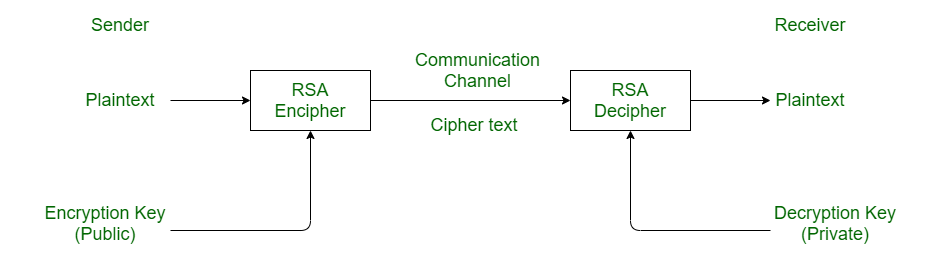

# 3.2 Usability Testing

## Criteria To Assess

To assess the usability of the project, I have put together a survey to get information on the user's experience whilst using the project. This survey is being used to assess the 5 key points:

| Test               | Test Details                                                                                                                                                                                                  |
| ------------------ | ------------------------------------------------------------------------------------------------------------------------------------------------------------------------------------------------------------- |
| 1 - Effective      | 
Do you understand the idea of the project? 

Do you understand the different parts of the project? 

Do you know how to setup the node software? 

Did you know how to use the website?
 |
| 2 - Efficient      | 
Is the website quick and easy to navigate through? 

Does the configuration file contain all needed settings?
                                                                                     |
| 3 - Engaging       | 
Did you like using the project? 

Did you like the style of the website? 

Was the messaging demo engaging?
                                                                                  |
| 4 - Error Tolerant | 
Did any parts of the project crash? 

Have you found any errors/bugs in the node software? 

If so, what are they?
                                                                           |
| 5 - Easy to Learn  | 
Did you know how to use the messaging demo without any help? 

Did you know how to setup a node? 

Did you know how to use tokens to get access to the dashboard?
                            |

Listed below are the results to the questions and why these questions were important, I will then go over the results of the survey in detail in the evaluation.


### The survey can be found here:

#### [Google Form Link](https://docs.google.com/forms/d/e/1FAIpQLScTNJ4TlDIStChrvM2K4rUQdQEADGM4Q45EbDKfjHxSQKtoEQ/viewform)&#x20;


## User Feedback



### Do you understand the idea of the project?&#x20;

<figure><figcaption></figcaption></figure>

This aim of this question was to ensure that the website/webportal explained the project quickly and easily enough that the users that looked at it understood the idea of project without any further explanation. As shown it appears that most users (80%) understood the point of the project in some reasonable amount, however, none of the users seemed to understand the project in great detail and one user responded with a disagreement to say that they did not understand the project.&#x20;

### Do you understand the different parts of the project?&#x20;

<figure><figcaption></figcaption></figure>

This question&#x20;

### Do you know how to setup the node software?&#x20;

<figure><figcaption></figcaption></figure>

Question info

### Did you know how to use the website

<figure><figcaption></figcaption></figure>

Question explanation.



<figure><figcaption></figcaption></figure>

<figure><figcaption></figcaption></figure>




<figure><figcaption></figcaption></figure>

<figure><figcaption></figcaption></figure>

<figure><figcaption></figcaption></figure>



<figure><figcaption></figcaption></figure>

<figure><figcaption></figcaption></figure>

<figure><figcaption></figcaption></figure>



<figure><figcaption></figcaption></figure>

<figure><figcaption></figcaption></figure>

<figure><figcaption></figcaption></figure>



## Usability Requirements in Success Criteria

Some of the success criteria requirements fall into the section of usability. These will also be tested now and are listed below:

| Criterion | Description           |
| --------- | --------------------- |
| X         | describe the critiera |

### Criterion X

Describe testing against criteria
